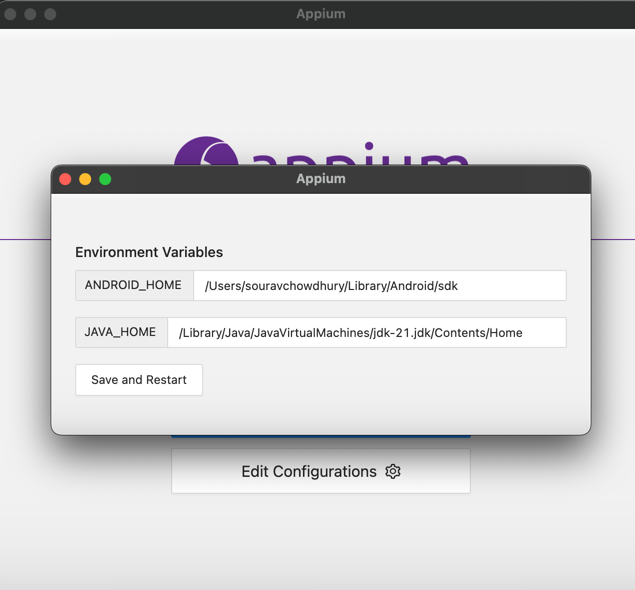
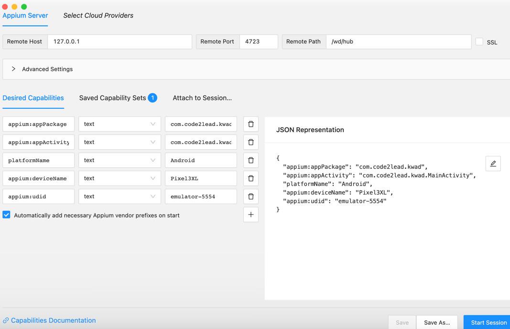
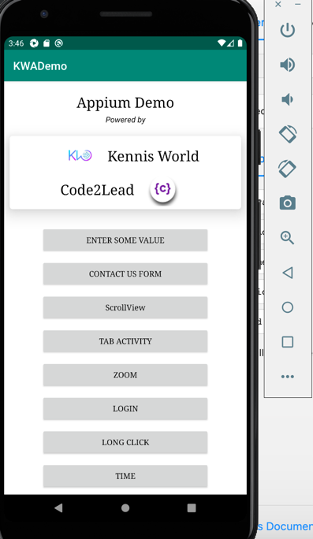
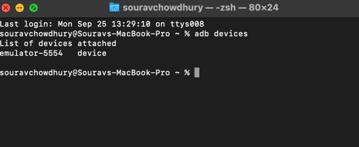
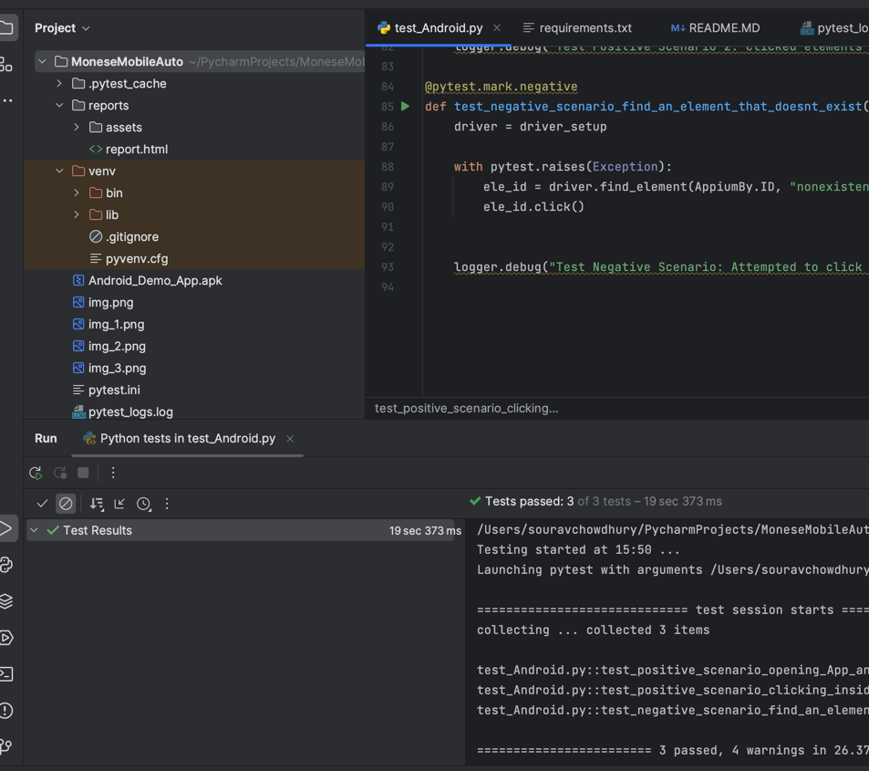
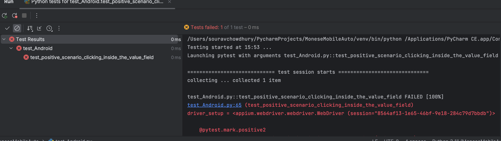
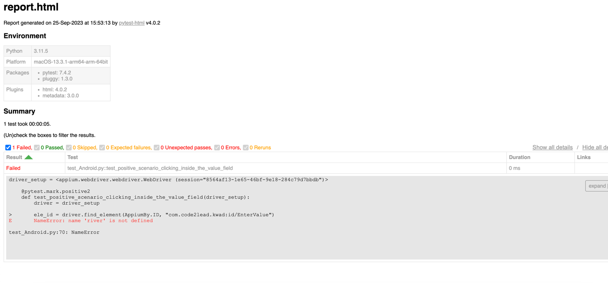

This project cover Android App test automation using Python3

(A)
Requirements other than listed in requirements.txt
1. Appium Inspector https://github.com/appium/appium-inspector
2. Appium Server GUI https://github.com/appium/appium-desktop
3. Android Studio for creating emulator
4. Android Demo APK (check the project)
5. JDK https://www.oracle.com/java/technologies/downloads/

(B) 
setting up path and environments
1. In you Appium Server GUI provide 
   correct path for ANDROID_HOME and JAVA_HOME

2. Appium Inspector should have desired capabilities configured
   

3. Demo app should be installed in the emulator:
   

(B)
How to run:
1. Clone this project
2. Install dependencies from requirements.txt
3. Turn on your emulator - available adb devices can be seen
   in the terminal with command "adb devices"
   
4. Start Appium server and Appium inspector
5. and run test_Android.py

Additional note: 

1. When tests will pass
  ex: 

2. <>reports.html will not log any error
3. When any test fails <>reports.html will register log
 ex: 
 
# Monese_Android_Automation
